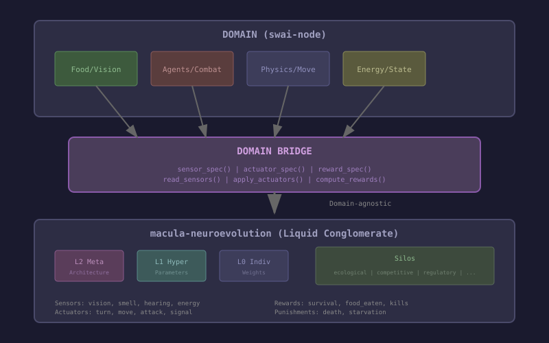

# Domain Bridge Architecture Proposal

**Date:** 2025-12-27
**Context:** Lessons from swai-node as testbed for macula-neuroevolution

---

## Core Principle

**macula-tweann and macula-neuroevolution MUST remain domain-agnostic.**

The vision fix I made (food/agent/wall channels) is domain-specific knowledge that should NOT be in the core libraries. Instead, we need a clean **Domain Bridge** that translates between:

- Domain semantics (food, enemies, energy)
- Library abstractions (sensors, actuators, rewards)

---

## The Domain Bridge Pattern



---

## Module Locations (Dependency Inversion)

Following clean/inverted architecture, **behaviours are defined in inner modules** (the library) while **implementations live in outer modules** (the domain application).

### Behaviours (macula-neuroevolution)

These define what the library expects from any domain:

```
macula-neuroevolution/
└── src/
    └── domain_bridge/
        ├── domain_sensors.erl       %% Behaviour: what sensors does the domain provide?
        ├── domain_actuators.erl     %% Behaviour: what actuators does the domain accept?
        └── domain_rewards.erl       %% Behaviour: what reward signals does the domain emit?
```

### Implementations (swai-node or any domain application)

These fulfill the contracts defined by the library:

```
swai-node/
└── lib/swai_node/
    └── neuroevolution/
        └── domain_bridge.ex         %% Implements :domain_sensors, :domain_actuators, :domain_rewards
```

This ensures:
- **macula-neuroevolution** has no knowledge of food, agents, walls, or any domain concept
- **swai-node** depends on macula-neuroevolution, not the other way around
- New domains only need to implement the bridge behaviours

---

## Proposed Behaviours

> **Location:** `macula-neuroevolution/src/domain_bridge/`

### 1. Domain Sensor Provider

```erlang
%% File: macula-neuroevolution/src/domain_bridge/domain_sensors.erl
-module(domain_sensors).
-callback sensor_spec() -> [sensor_definition()].
-callback read_sensors(DomainState :: term()) -> sensor_readings().

-type sensor_definition() :: #{
    name := atom(),
    dimension := pos_integer(),
    range := {Min :: float(), Max :: float()},
    level := l0 | l1 | l2,           %% Which LC level uses this
    category := atom(),               %% For silo routing
    description := binary()
}.

-type sensor_readings() :: #{atom() => [float()]}.
```

### 2. Domain Actuator Consumer

```erlang
%% File: macula-neuroevolution/src/domain_bridge/domain_actuators.erl
-module(domain_actuators).
-callback actuator_spec() -> [actuator_definition()].
-callback apply_actuators(actuator_outputs(), DomainState) -> NewDomainState.

-type actuator_definition() :: #{
    name := atom(),
    dimension := pos_integer(),
    range := {Min :: float(), Max :: float()},
    level := l0 | l1 | l2,
    category := atom(),
    description := binary()
}.

-type actuator_outputs() :: #{atom() => [float()]}.
```

### 3. Domain Reward Provider

```erlang
%% File: macula-neuroevolution/src/domain_bridge/domain_rewards.erl
-module(domain_rewards).
-callback reward_spec() -> [reward_definition()].
-callback compute_rewards(DomainState, Metrics) -> reward_signals().

-type reward_definition() :: #{
    name := atom(),
    weight := float(),                %% Relative importance
    level := l0 | l1 | l2,
    sign := reward | punishment,      %% Affects sign of signal
    category := atom(),               %% For silo routing
    description := binary()
}.

-type reward_signals() :: #{atom() => float()}.
```

---

## Hierarchical Mapping (L2 → L1 → L0)

### L0: Individual Evaluation (Fast, Per-Network)

**Sensors** (from domain):
```erlang
#{
  vision_food => [0.3, 1.0, 1.0, 0.5, ...],    %% 8 floats
  vision_agent => [1.0, 0.8, 1.0, 1.0, ...],   %% 8 floats
  vision_wall => [1.0, 1.0, 0.9, 1.0, ...],    %% 8 floats
  hearing => [0.5, 0.0, 0.3, 0.0],             %% 4 floats
  smell => [0.7, 0.2, 0.1],                    %% 3 floats
  internal => [0.8, 0.01, 0.5, 0.9, 0.5, 0.1]  %% 6 floats (energy, age, etc.)
}
```

**Actuators** (to domain):
```erlang
#{
  turn => [0.3],           %% -1 to 1
  move => [0.8],           %% 0 to 1
  signal => [0.5],         %% 0 to 1
  attack => [-0.2]         %% threshold for attacking
}
```

**Rewards** (from domain):
```erlang
#{
  survival => 1.0,         %% +1 per tick alive
  food_eaten => 50.0,      %% +50 per food
  kill => 100.0,           %% +100 per kill
  energy_efficiency => 0.1 %% reward for conserving energy
}
```

### L1: Population Tuning (Medium, Per-Generation)

**Sensors** (aggregated from L0):
```erlang
#{
  avg_fitness => 0.65,
  fitness_variance => 0.12,
  best_fitness => 0.92,
  population_diversity => 0.78,
  convergence_rate => 0.05,
  stagnation_count => 3
}
```

**Actuators** (hyperparameters):
```erlang
#{
  mutation_rate => 0.15,
  mutation_strength => 0.25,
  selection_pressure => 0.20,
  elitism_ratio => 0.05
}
```

**Rewards**:
```erlang
#{
  fitness_improvement => 0.8,   %% Generation over generation
  diversity_maintenance => 0.6, %% Prevent premature convergence
  efficiency => 0.4             %% Fewer evaluations to improve
}
```

### L2: Meta-Learning (Slow, Architectural)

**Sensors** (long-term patterns):
```erlang
#{
  sensor_utilization => #{vision_food => 0.9, hearing => 0.2},
  learning_curve_slope => 0.02,
  plateau_duration => 15,
  best_topology_performance => 0.85
}
```

**Actuators** (architecture):
```erlang
#{
  enable_sensor => #{hearing => false},  %% Disable unused sensors
  topology_change => add_hidden_layer,
  sensor_resolution => #{vision => 16}   %% Increase from 8 to 16 rays
}
```

**Rewards**:
```erlang
#{
  generalization => 0.7,        %% Performance on novel environments
  learning_speed => 0.5,        %% How fast L0 improves
  architecture_efficiency => 0.3 %% Smaller networks preferred
}
```

---

## Silo Integration

Each silo can subscribe to domain signals based on **category**:

| Silo | Sensor Categories | Actuator Categories | Reward Categories |
|------|-------------------|---------------------|-------------------|
| ecological | smell, resource | food_spawn, move_cost | resource_efficiency |
| morphological | network_stats | topology | architecture |
| competitive | other_agents | attack, signal | kills, dominance |
| developmental | age, generation | maturation_rate | longevity |
| regulatory | internal_state | thresholds | homeostasis |

### Silo-Specific Behaviours

> **Location:** Both behaviours AND implementations live in `macula-neuroevolution/`
>
> Unlike domain behaviours (which domains implement), silo behaviours are internal to the library.
> Each silo (ecological_silo, morphological_silo, etc.) implements these behaviours.

```erlang
%% File: macula-neuroevolution/src/silo_integration/silo_sensor_consumer.erl
-behaviour(silo_sensor_consumer).
-callback relevant_sensors() -> [atom()].  %% Which sensors this silo cares about
-callback process_sensors(SensorReadings) -> SiloState.

%% File: macula-neuroevolution/src/silo_integration/silo_actuator_producer.erl
-behaviour(silo_actuator_producer).
-callback relevant_actuators() -> [atom()].
-callback compute_actuators(SiloState) -> ActuatorOutputs.

%% File: macula-neuroevolution/src/silo_integration/silo_reward_consumer.erl
-behaviour(silo_reward_consumer).
-callback relevant_rewards() -> [atom()].
-callback process_rewards(RewardSignals, SiloState) -> NewSiloState.
```

---

## Example: SwaiNode Domain Bridge

> **Location:** `swai-node/lib/swai_node/neuroevolution/domain_bridge.ex`
>
> This is a **domain implementation** that fulfills the behaviours defined in macula-neuroevolution.
> The library calls these functions - it never knows about "food" or "vision".

```elixir
# File: swai-node/lib/swai_node/neuroevolution/domain_bridge.ex
defmodule SwaiNode.DomainBridge do
  @behaviour :domain_sensors
  @behaviour :domain_actuators
  @behaviour :domain_rewards

  # Declare what sensors this domain provides
  def sensor_spec do
    [
      %{name: :vision_food, dimension: 8, range: {0.0, 1.0}, level: :l0,
        category: :ecological, description: "Distance to food in 8 directions"},
      %{name: :vision_agent, dimension: 8, range: {0.0, 1.0}, level: :l0,
        category: :competitive, description: "Distance to agents in 8 directions"},
      %{name: :vision_wall, dimension: 8, range: {0.0, 1.0}, level: :l0,
        category: :spatial, description: "Distance to walls in 8 directions"},
      %{name: :hearing, dimension: 4, range: {0.0, 1.0}, level: :l0,
        category: :communication, description: "Signals from 4 nearest agents"},
      %{name: :smell, dimension: 3, range: {0.0, 1.0}, level: :l0,
        category: :ecological, description: "Food, prey, threat density"},
      %{name: :internal, dimension: 6, range: {0.0, 1.0}, level: :l0,
        category: :regulatory, description: "Energy, age, direction, signal, generation"}
    ]
  end

  # Read current sensor values from domain state
  def read_sensors(%{agent: agent, world: world}) do
    vision = Vision.cast_rays(agent, world.agents, world.food, world.size)
    %{
      vision_food: Enum.slice(vision, 0, 8),
      vision_agent: Enum.slice(vision, 8, 8),
      vision_wall: Enum.slice(vision, 16, 8),
      hearing: calculate_hearing(agent, world.agents),
      smell: calculate_smell(agent, world),
      internal: [agent.energy/200, agent.age/10000, ...]
    }
  end

  # Declare what actuators this domain accepts
  def actuator_spec do
    [
      %{name: :turn, dimension: 1, range: {-1.0, 1.0}, level: :l0,
        category: :motor, description: "Rotation amount"},
      %{name: :move, dimension: 1, range: {0.0, 1.0}, level: :l0,
        category: :motor, description: "Forward movement speed"},
      %{name: :signal, dimension: 1, range: {0.0, 1.0}, level: :l0,
        category: :communication, description: "Broadcast signal value"},
      %{name: :attack, dimension: 1, range: {-1.0, 1.0}, level: :l0,
        category: :competitive, description: "Attack threshold"}
    ]
  end

  # Apply actuator outputs to domain
  def apply_actuators(outputs, domain_state) do
    agent = domain_state.agent
    updated_agent = %{agent |
      direction: agent.direction + outputs.turn * 0.1,
      x: agent.x + :math.cos(agent.direction) * outputs.move * 2.0,
      y: agent.y + :math.sin(agent.direction) * outputs.move * 2.0,
      signal: outputs.signal,
      wants_attack: outputs.attack > 0
    }
    %{domain_state | agent: updated_agent}
  end

  # Declare reward signals
  def reward_spec do
    [
      %{name: :survival, weight: 1.0, level: :l0, sign: :reward,
        category: :temporal, description: "Ticks survived"},
      %{name: :food_eaten, weight: 50.0, level: :l0, sign: :reward,
        category: :ecological, description: "Food consumption"},
      %{name: :kill, weight: 100.0, level: :l0, sign: :reward,
        category: :competitive, description: "Successful hunts"},
      %{name: :death, weight: -100.0, level: :l0, sign: :punishment,
        category: :temporal, description: "Death penalty"}
    ]
  end

  # Compute reward signals from metrics
  def compute_rewards(_state, metrics) do
    %{
      survival: metrics.ticks_survived * 1.0,
      food_eaten: metrics.food_eaten * 50.0,
      kill: metrics.kills * 100.0,
      death: if(metrics.died, do: -100.0, else: 0.0)
    }
  end
end
```

---

## Benefits of This Architecture

1. **Domain Agnosticism**: macula-neuroevolution never sees "food" or "vision" - only sensors/actuators/rewards
2. **Arbitrary Dimensionality**: Domain defines sensor/actuator dimensions
3. **Silo Routing**: Categories enable silos to subscribe to relevant signals
4. **Hierarchical Integration**: L0/L1/L2 levels operate on appropriate abstractions
5. **Plug-and-Play Domains**: New domains just implement the bridge behaviours
6. **Testability**: Bridge can be mocked for unit testing

---

## Implementation Path

1. **Phase 1**: Define behaviours in macula-neuroevolution
   - `domain_sensors.erl`
   - `domain_actuators.erl`
   - `domain_rewards.erl`

2. **Phase 2**: Update neuroevolution_server to use bridge
   - Read sensor spec on init
   - Build network topology from specs
   - Route signals to appropriate silos

3. **Phase 3**: Update silos to consume categorized signals
   - Add `relevant_sensors/0` to silo behaviours
   - Filter signals by category

4. **Phase 4**: Implement bridge in swai-node
   - Create `SwaiNode.DomainBridge`
   - Migrate from hardcoded AgentBrain to bridge

---

## Open Questions

1. **Dynamic sensor changes**: Can L2 add/remove sensors at runtime?
2. **Sensor dependencies**: Some sensors depend on others (hearing needs agents)
3. **Actuator constraints**: Some actuators may conflict (move + attack same tick?)
4. **Reward normalization**: Should rewards be normalized across categories?
5. **Cross-domain transfer**: Can a trained bridge work across similar domains?
