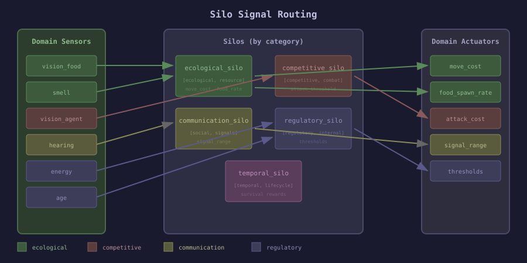

# Silo Signal Routing Architecture

**Date:** 2025-12-27
**Context:** Extending Domain Bridge to Liquid Conglomerate silos

---

## The Routing Problem

Each silo in LC has a specific responsibility. When domain signals arrive, they need to be **routed to the appropriate silo(s)** based on their category. Similarly, silo outputs need to be **aggregated and applied** to the domain.



---

## Module Locations (Dependency Inversion)

All silo-related behaviours and implementations live **within macula-neuroevolution** because silos are part of the library, not the domain.

### Behaviours (macula-neuroevolution)

```
macula-neuroevolution/
└── src/
    └── silo_integration/
        ├── silo_sensors.erl        %% Behaviour: how silos consume domain sensor signals
        ├── silo_actuators.erl      %% Behaviour: how silos produce actuator outputs
        ├── silo_rewards.erl        %% Behaviour: how silos process reward signals
        └── silo_punishments.erl    %% Behaviour: how silos process punishment signals
```

### Implementations (also macula-neuroevolution)

Each existing silo implements these behaviours:

```
macula-neuroevolution/
└── src/
    └── silos/
        ├── ecological_silo.erl     %% Implements silo_sensors, silo_actuators, silo_rewards
        ├── competitive_silo.erl    %% Implements silo_sensors, silo_actuators, silo_rewards
        ├── regulatory_silo.erl     %% Implements silo_sensors, silo_rewards
        ├── morphological_silo.erl  %% Implements silo_actuators (topology changes)
        └── task_silo.erl           %% Implements silo_actuators (hyperparameters)
```

### Signal Router (macula-neuroevolution)

```
macula-neuroevolution/
└── src/
    └── domain_bridge/
        └── signal_router.erl       %% Routes domain signals to appropriate silos by category
```

---

## Proposed Silo Behaviours

> **Location:** `macula-neuroevolution/src/silo_integration/`

### SiloSensors - Consume Domain Signals

```erlang
%% File: macula-neuroevolution/src/silo_integration/silo_sensors.erl
-module(silo_sensors).

%% Which sensor categories this silo processes
-callback sensor_categories() -> [atom()].

%% Transform raw sensor readings into silo-internal representation
-callback process_sensors(CategoryReadings :: map(), SiloState) ->
    {SiloSensors :: map(), NewSiloState}.

%% Example for ecological_silo:
%% sensor_categories() -> [ecological, resource].
%% process_sensors(#{smell := [FoodDensity, _, _]}, State) ->
%%     {#{resource_abundance => FoodDensity}, State}.
```

### SiloActuators - Produce Domain Modifications

```erlang
%% File: macula-neuroevolution/src/silo_integration/silo_actuators.erl
-module(silo_actuators).

%% Which actuator categories this silo controls
-callback actuator_categories() -> [atom()].

%% Compute actuator outputs based on silo state
-callback compute_actuators(SiloState) -> ActuatorOutputs :: map().

%% Priority for actuator conflicts (higher = override lower)
-callback actuator_priority() -> integer().

%% Example for ecological_silo:
%% actuator_categories() -> [resource_params].
%% compute_actuators(State) -> #{
%%     move_cost => compute_optimal_cost(State),
%%     food_spawn_rate => compute_spawn_rate(State)
%% }.
%% actuator_priority() -> 50.  %% Medium priority
```

### SiloRewards - Process Reward Signals

```erlang
%% File: macula-neuroevolution/src/silo_integration/silo_rewards.erl
-module(silo_rewards).

%% Which reward categories this silo uses for its own learning
-callback reward_categories() -> [atom()].

%% Transform domain rewards into silo-internal reward
-callback process_rewards(CategoryRewards :: map(), SiloState) ->
    {SiloReward :: float(), NewSiloState}.

%% Example for ecological_silo:
%% reward_categories() -> [ecological, resource].
%% process_rewards(#{food_eaten := FoodReward}, State) ->
%%     %% Ecological silo is rewarded when agents find food efficiently
%%     Efficiency = FoodReward / State.resource_cost,
%%     {Efficiency, State}.
```

### SiloPunishments - Process Negative Signals

```erlang
%% File: macula-neuroevolution/src/silo_integration/silo_punishments.erl
-module(silo_punishments).

%% Which punishment categories affect this silo
-callback punishment_categories() -> [atom()].

%% Transform domain punishments into silo-internal signal
-callback process_punishments(CategoryPunishments :: map(), SiloState) ->
    {SiloPunishment :: float(), NewSiloState}.

%% Example for ecological_silo:
%% punishment_categories() -> [extinction, starvation].
%% process_punishments(#{death := Deaths}, State) ->
%%     %% High death rate = ecological parameters too harsh
%%     {Deaths * 0.1, State}.
```

---

## Hierarchical Signal Flow

### L0 Level (Per-Individual, Fast)

```
Individual Evaluation
         │
         ▼
┌─────────────────────────────────────────────────────┐
│                   Domain Bridge                      │
│  read_sensors() → [vision, hearing, smell, ...]     │
│  apply_actuators() ← [turn, move, attack, ...]      │
│  compute_rewards() → [survival, food, kills, ...]   │
└─────────────────────────────────────────────────────┘
         │
         ▼
┌─────────────────────────────────────────────────────┐
│              L0 Signal Router                        │
│                                                      │
│  Sensors:                                           │
│    ecological: [smell, food_vision] → ecological_silo
│    competitive: [agent_vision, attack] → competitive_silo
│    regulatory: [energy, age] → regulatory_silo       │
│                                                      │
│  Actuators:                                         │
│    motor: [turn, move] ← network output             │
│    combat: [attack] ← network output + threshold    │
│                                                      │
│  Rewards:                                           │
│    → Aggregated into fitness for selection          │
└─────────────────────────────────────────────────────┘
```

### L1 Level (Per-Generation, Medium)

```
Generation Complete
         │
         ▼
┌─────────────────────────────────────────────────────┐
│              L1 Signal Router                        │
│                                                      │
│  Sensors (aggregated from L0):                      │
│    population: [avg_fitness, diversity, convergence]│
│    resource: [total_food_eaten, starvation_rate]    │
│    competitive: [kill_rate, attack_success]         │
│                                                      │
│  Actuators (hyperparameters):                       │
│    evolution: [mutation_rate, selection_pressure]   │
│    resource: [move_cost, food_spawn_rate] ← eco_silo│
│    competitive: [attack_threshold] ← comp_silo      │
│                                                      │
│  Rewards:                                           │
│    → Silo internal rewards for self-tuning          │
└─────────────────────────────────────────────────────┘
```

### L2 Level (Meta, Slow)

```
Plateau Detected / Major Event
         │
         ▼
┌─────────────────────────────────────────────────────┐
│              L2 Signal Router                        │
│                                                      │
│  Sensors (long-term patterns):                      │
│    utilization: [which sensors are used?]           │
│    architecture: [current topology performance]     │
│    learning: [improvement rate, plateau duration]   │
│                                                      │
│  Actuators (structural):                            │
│    topology: [add/remove sensors, change layers]    │
│    silo_weights: [adjust silo influence]            │
│                                                      │
│  Rewards:                                           │
│    → Meta-learning reward (generalization, speed)   │
└─────────────────────────────────────────────────────┘
```

---

## Signal Category Taxonomy

### Sensor Categories

| Category | Description | Example Sensors | Primary Silo |
|----------|-------------|-----------------|--------------|
| ecological | Resource detection | smell, food_vision | ecological_silo |
| competitive | Other agent detection | agent_vision, threats | competitive_silo |
| spatial | Environment structure | wall_vision, position | morphological_silo |
| communication | Social signals | hearing, signals | communication_silo |
| regulatory | Internal state | energy, age, health | regulatory_silo |
| temporal | Time-based | tick, generation | temporal_silo |
| developmental | Growth stage | maturity, size | developmental_silo |

### Actuator Categories

| Category | Description | Example Actuators | Primary Silo |
|----------|-------------|-------------------|--------------|
| motor | Movement control | turn, move, speed | - (network) |
| combat | Aggression | attack, defend | competitive_silo |
| social | Communication | signal, broadcast | communication_silo |
| metabolic | Resource usage | eat_threshold, rest | regulatory_silo |
| resource_params | World parameters | move_cost, food_rate | ecological_silo |
| evolution_params | Training params | mutation_rate | task_silo |

### Reward Categories

| Category | Description | Example Rewards | Primary Silo |
|----------|-------------|-----------------|--------------|
| survival | Staying alive | ticks_alive | temporal_silo |
| resource | Resource acquisition | food_eaten | ecological_silo |
| competitive | Dominance | kills, territory | competitive_silo |
| social | Cooperation | signals_received | communication_silo |
| efficiency | Resource efficiency | energy_per_tick | regulatory_silo |

---

## Implementation in macula-neuroevolution

### Complete File Structure

```
macula-neuroevolution/src/
├── domain_bridge/                        %% Domain ↔ Library boundary
│   ├── domain_sensors.erl                %% BEHAVIOUR: domains implement this
│   ├── domain_actuators.erl              %% BEHAVIOUR: domains implement this
│   ├── domain_rewards.erl                %% BEHAVIOUR: domains implement this
│   └── signal_router.erl                 %% Routes signals to silos by category
│
├── silo_integration/                     %% Silo ↔ Domain Bridge boundary
│   ├── silo_sensors.erl                  %% BEHAVIOUR: silos implement this
│   ├── silo_actuators.erl                %% BEHAVIOUR: silos implement this
│   ├── silo_rewards.erl                  %% BEHAVIOUR: silos implement this
│   └── silo_punishments.erl              %% BEHAVIOUR: silos implement this
│
└── silos/                                %% Silo implementations
    ├── ecological_silo.erl               %% -behaviour(silo_sensors, silo_actuators, silo_rewards)
    ├── competitive_silo.erl              %% -behaviour(silo_sensors, silo_actuators, silo_rewards)
    ├── regulatory_silo.erl               %% -behaviour(silo_sensors, silo_rewards)
    ├── morphological_silo.erl            %% -behaviour(silo_actuators)
    └── task_silo.erl                     %% -behaviour(silo_actuators)
```

**Domain application (e.g., swai-node):**
```
swai-node/lib/swai_node/
└── neuroevolution/
    └── domain_bridge.ex                  %% -behaviour(:domain_sensors, :domain_actuators, :domain_rewards)
```

### Updated neuroevolution_server

```erlang
%% File: macula-neuroevolution/src/neuroevolution_server.erl
init(Config) ->
    %% Get domain bridge module
    Bridge = maps:get(domain_bridge, Config),

    %% Read sensor/actuator specs
    SensorSpec = Bridge:sensor_spec(),
    ActuatorSpec = Bridge:actuator_spec(),
    RewardSpec = Bridge:reward_spec(),

    %% Compute network topology from specs
    InputSize = compute_input_size(SensorSpec),
    OutputSize = compute_output_size(ActuatorSpec),
    Topology = {InputSize, HiddenLayers, OutputSize},

    %% Initialize signal router
    Router = signal_router:new(SensorSpec, ActuatorSpec, RewardSpec),

    %% Start silos with category subscriptions
    start_silos_with_categories(Router),
    ...
```

---

## Cross-Silo Coordination

When multiple silos want to control the same actuator category:

```erlang
%% File: macula-neuroevolution/src/domain_bridge/signal_router.erl
resolve_actuator_conflicts(ActuatorOutputs) ->
    %% Group by actuator name
    Grouped = group_by_name(ActuatorOutputs),

    %% For each actuator, resolve conflicts
    maps:map(fun(Name, Candidates) ->
        %% Sort by priority
        Sorted = lists:sort(fun priority_compare/2, Candidates),

        %% Options:
        %% 1. Winner-take-all (highest priority)
        %% 2. Weighted average
        %% 3. Constraint satisfaction

        resolve_candidates(Sorted)
    end, Grouped).
```

---

## Benefits

1. **Clean Separation**: Domain knows nothing about silos, silos know nothing about domain
2. **Composable**: Add new sensor/actuator/reward types without changing silos
3. **Hierarchical**: L0/L1/L2 naturally emerge from category granularity
4. **Testable**: Each component can be tested in isolation
5. **Extensible**: New silos can subscribe to existing categories

---

## Next Steps

1. Define core behaviours in macula-neuroevolution
2. Implement signal_router
3. Update existing silos with category subscriptions
4. Create reference domain bridge (SwaiNode)
5. Test full signal flow L0→L1→L2
